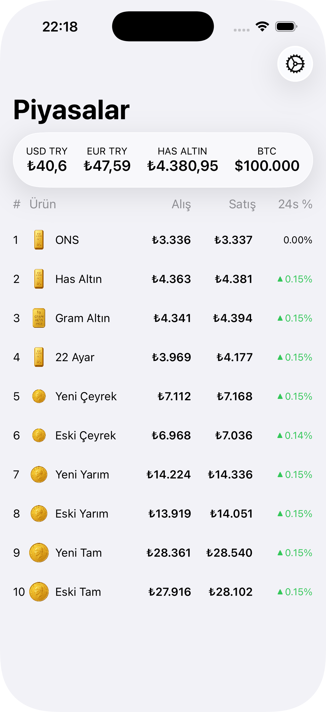

# 💱 Sarraf: Grand Bazaar Live Gold & Currency Tracker

This is a lightweight iOS app built with SwiftUI that displays **real-time gold** and **foreign exchange** (FX) buy/sell prices from Istanbul’s historical Grand Bazaar.



## 🔧 Getting Started

Clone the repo and open in Xcode(a backend url needs to be added to the config file to see the action):

```bash
git clone https://github.com/EmirhanKarahan/sarraf-app
cd sarraf
xed .